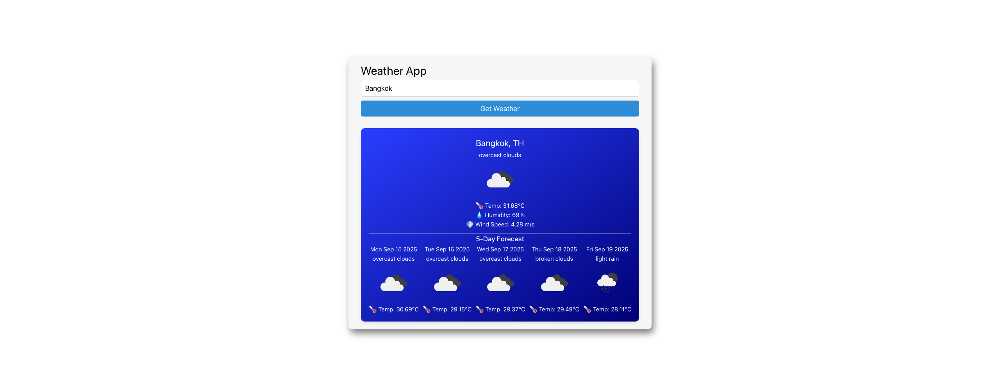

# weather-app
My Weather App with Vue.js using OpenWeatherMap API
This weather application is built using Vue.js and leverages the OpenWeatherMap API to fetch weather data. Users can search for weather information by city, with the app displaying current conditions, temperature, humidity, and wind speed. 

## Screenshot



## Project Setup

```sh
npm install
```

### Compile and Hot-Reload for Development

```sh
npm run dev
```

### Compile and Minify for Production

```sh
npm run build
```
